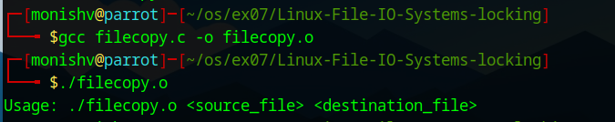
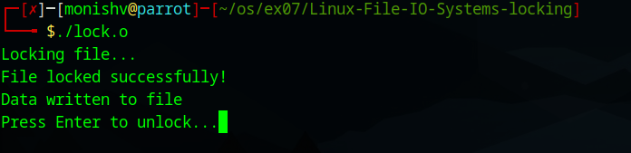

# Linux-File-IO-Systems-locking
Ex07-Linux File-IO Systems-locking
# AIM:
To Write a C program that illustrates files copying and locking

# DESIGN STEPS:

### Step 1:

Navigate to any Linux environment installed on the system or installed inside a virtual environment like virtual box/vmware or online linux JSLinux (https://bellard.org/jslinux/vm.html?url=alpine-x86.cfg&mem=192) or docker.

### Step 2:

Write the C Program using Linux IO Systems locking

### Step 3:

Execute the C Program for the desired output. 

# PROGRAM:

## 1.To Write a C program that illustrates files copying 

#include <unistd.h>
#include <sys/stat.h>
#include <fcntl.h>
#include <stdlib.h>
#include <stdio.h>

int main(int argc, char *argv[])
{
    if (argc != 3)
    {
        fprintf(stderr, "Usage: %s <source_file> <destination_file>\n", argv[0]);
        exit(EXIT_FAILURE);
    }

    char block[1024];
    int in, out;
    ssize_t nread;

    // Open source file
    in = open(argv[1], O_RDONLY);
    if (in == -1)
    {
        perror("Error opening source file");
        exit(EXIT_FAILURE);
    }

    // Open destination file
    out = open(argv[2], O_WRONLY | O_CREAT | O_TRUNC, S_IRUSR | S_IWUSR);
    if (out == -1)
    {
        perror("Error opening destination file");
        close(in);
        exit(EXIT_FAILURE);
    }

    // Copy contents
    while ((nread = read(in, block, sizeof(block))) > 0)
    {
        if (write(out, block, nread) != nread)
        {
            perror("Error writing to destination file");
            close(in);
            close(out);
            exit(EXIT_FAILURE);
        }
    }

    if (nread == -1)
    {
        perror("Error reading source file");
    }

    close(in);
    close(out);

    return EXIT_SUCCESS;
}

## 2.To Write a C program that illustrates files locking

#include <stdio.h>
#include <fcntl.h>
#include <unistd.h>

int main()
{
    int fd;
    struct flock lock;

    fd = open("locked.txt", O_RDWR | O_CREAT, 0644);
    if (fd < 0)
    {
        printf("Error opening file!\n");
        return 1;
    }

    // Set write lock
    lock.l_type = F_WRLCK;
    lock.l_whence = SEEK_SET;
    lock.l_start = 0;
    lock.l_len = 0;
    lock.l_pid = getpid();

    printf("Locking file...\n");

    if (fcntl(fd, F_SETLK, &lock) == -1)
    {
        printf("File already locked by another process!\n");
        close(fd);
        return 1;
    }

    printf("File locked successfully!\n");

    // Write to file
    write(fd, "This is locked content", 23);
    printf("Data written to file\n");

    printf("Press Enter to unlock...");
    getchar();

    // Unlock file
    lock.l_type = F_UNLCK;
    fcntl(fd, F_SETLK, &lock);

    printf("File unlocked!\n");

    close(fd);
    return 0;
}

## OUTPUT

# RESULT:
The programs are executed successfully.
